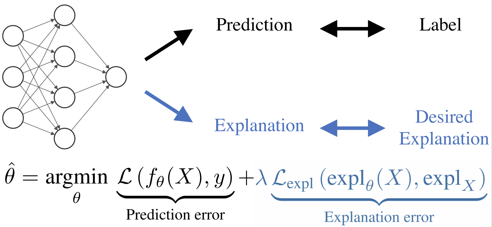
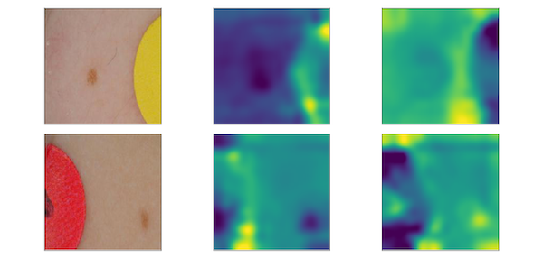
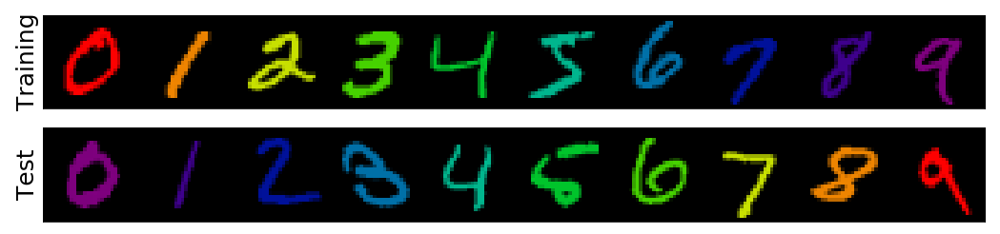
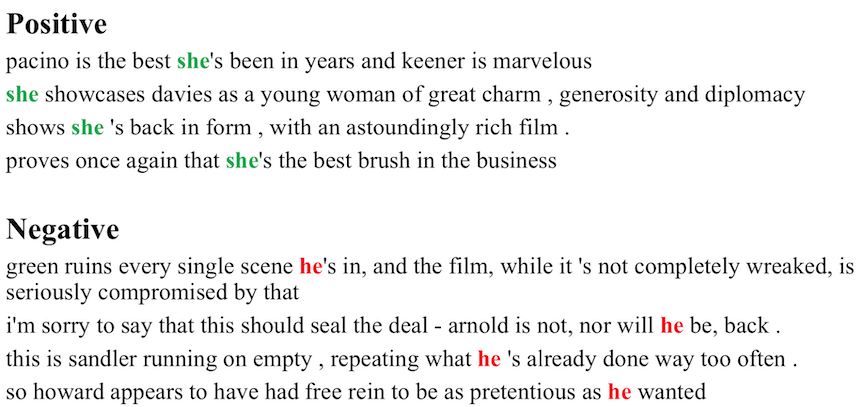

Official code for using / reproducing CDEP from the paper *Interpretations are useful: penalizing explanations to align neural networks with prior knowledge* (ICML 2020 [pdf](https://arxiv.org/abs/1909.13584)). This code regularizes interpretations (computed via contextual decomposition) to improve neural networks (trained in pytorch).

*Note: this repo is actively maintained. For any questions please file an issue.*



# documentation

- fully-contained data/models/code for reproducing and experimenting with CDEP
- the [src](src) folder contains the core code for running and penalizing contextual decomposition
- in addition, we run experiments on 4 datasets, each of which are located in their own folders
  - notebooks in these folders show demos for different kinds of text
- tested with python 3.6 and pytorch 1.0

# examples

[ISIC skin-cancer classification](isic-skin-cancer) - using CDEP, we can learn to avoid spurious patches present in the training set, improving test performance!

<p align="center">
  </img>
</p>

[ColorMNIST](mnist) - penalizing the contributions of individual pixels allows us to teach a network to learn a digit's shape instead of its color, improving its test accuracy from 0.5% to 25.1%

<p align="center">
  </img>
</p>

[Fixing text gender biases](text) - CDEP can help to learn spurious biases in a dataset, such as gendered words

<p align="center">
  </img>
</p>

# using CDEP on your own data

using CDEP requires two steps:
1. run CD/ACD on your model. Specifically, 3 things must be altered:
  - the pred_ims function must be replaced by a function you write using your own trained model. This function gets predictions from a model given a batch of examples.
  - the model must be replaced with your model
  - the current CD implementation doesn't always work for all types of networks. If you are getting an error inside of `cd.py`, you may need to write a custom function that iterates through the layers of your network (for examples see `cd.py`)
2. add CD scores to the loss function (see notebooks)

# related work

- ACD (ICLR 2019 [pdf](https://openreview.net/pdf?id=SkEqro0ctQ), [github](https://github.com/csinva/hierarchical-dnn-interpretations)) - extends CD to CNNs / arbitrary DNNs, and aggregates explanations into a hierarchy
- PDR framework (PNAS 2019 [pdf](https://arxiv.org/abs/1901.04592)) - an overarching framewwork for guiding and framing interpretable machine learning
- TRIM (ICLR 2020 workshop [pdf](https://arxiv.org/abs/2003.01926), [github](https://github.com/csinva/transformation-importance)) - using simple reparameterizations, allows for calculating disentangled importances to transformations of the input (e.g. assigning importances to different frequencies)
- DAC (arXiv 2019 [pdf](https://arxiv.org/abs/1905.07631), [github](https://github.com/csinva/disentangled-attribution-curves)) - finds disentangled interpretations for random forests


# reference

- feel free to use/share this code openly

- if you find this code useful for your research, please cite the following:

```r
@article{rieger2019interp,
  title={Interpretations are useful: penalizing explanations to align neural networks with prior knowledge},
  author={Rieger, Laura and Singh, Chandan and Murdoch, W James and Yu, Bin},
  journal={arXiv preprint arXiv:1909.13584},
  year={2019}
}
```

  
